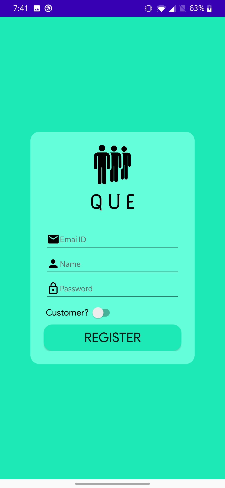
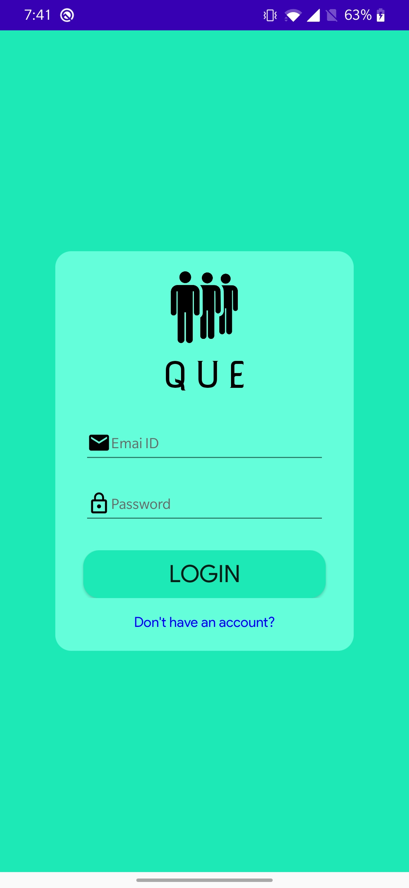
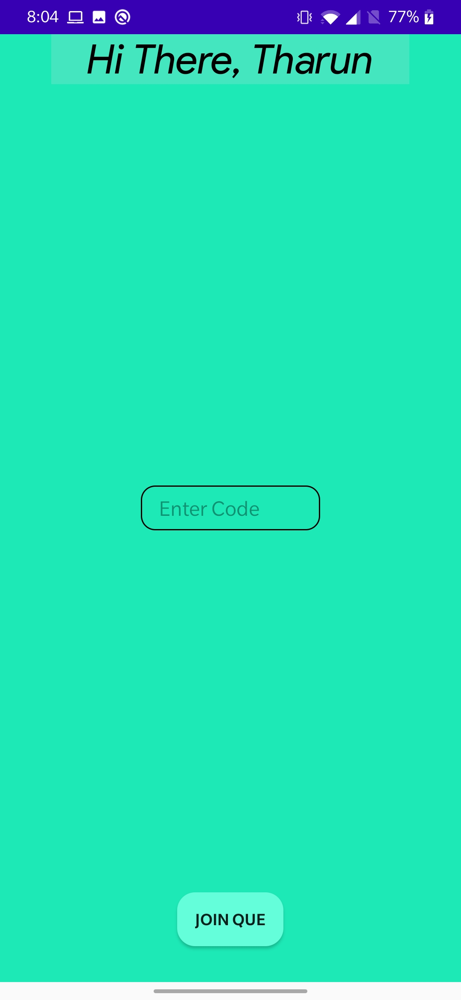
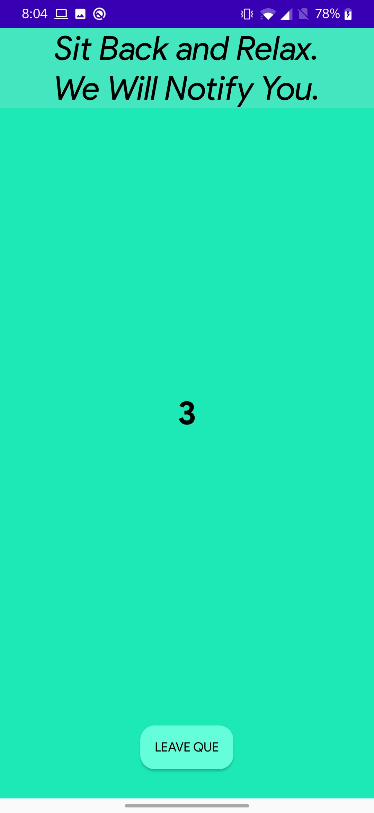
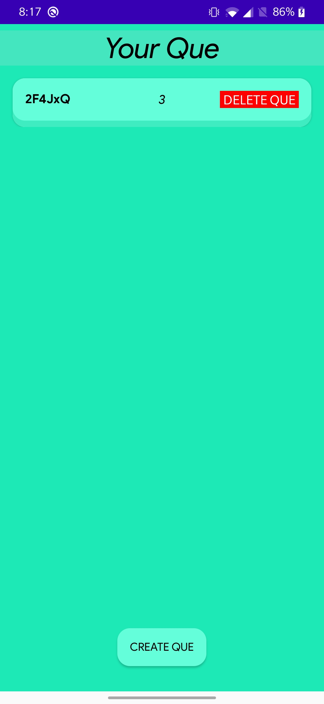

# QUE-Frontend

## Introduction

---

We aim to provide an easier way for people to access services that require waiting for their turn. With the current situation of the pandemic, it becomes essential to provide a way for people to maintain social distancing in everyday life. With essential everyday necessities including groceries or withdrawing money from the bank, that require people to wait in queues, our product provides a platform for the service giver to create a virtual queue which people can join, without physically rushing into a line. This way, the crowd outside their store/centre can be dismissed as people can wait away and avail the service once our app shows them their turn...

### Working of the API

---

- A Route to register the user. It takes in the following parameters:
  - Name
  - Email
  - Password
  - User is a shopkeeper or the service taker.
- Login using unique mail and password.
  - Returns a jwt token and the user info if successful login else retruns invalid credentials.
  - In case of an <strong>internal server error</strong> it returns 500 with that error.
- A route to get user information.
  - Sends the mongo Object id in the url for the user we want to get the information of.
  - Since this route is protected, send the jwt bearer in the Auth header.
- Route for creating new queue. It includes:
  - Adding a new user to the queue
  - Removing a user from the queue
  - Getting the position of a user in the queue
  - Getting list of people in the queue
  - Data of the person availing the service
  - Getting the count of the queue
  - Deleting the queue as a whole.

## Screenshots

---

|                             |                             |                             |
| :-------------------------: | :-------------------------: | :-------------------------: |
|  |  |  |
|  |  |

## Tools And Technologies Used

---

 

##
## 
# From the Developers

---

### Challenges Faced

- A major challenge that we faced was keeping track of authentic accounts and people leaving the queue.
- Connecting frontend and backend required learning new technologies.
- Keeping track of enqueing and dequeing and updating it live on the app was a challenge.

### Developers

- Frontend
  - <a href="https://github.com/dhruv1294">Dhruv</a>
  - <a href="https://github.com/Tharun-b777">Tharun</a>
  - <a href="https://github.com/saloni-rakholiya">Saloni</a>
- Backend
  - <a href="https://github.com/marmikupadhyay">Marmik</a>
  - <a href="https://github.com/malikakarsh">Akarsh</a>
